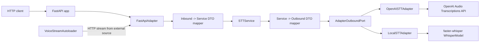
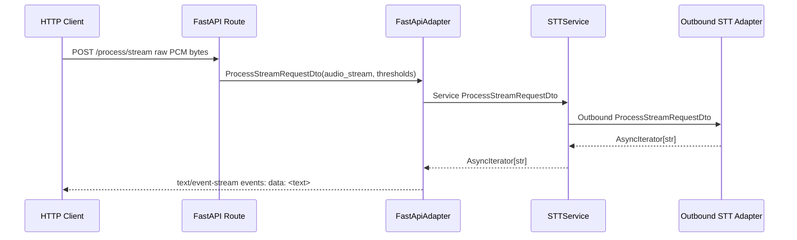
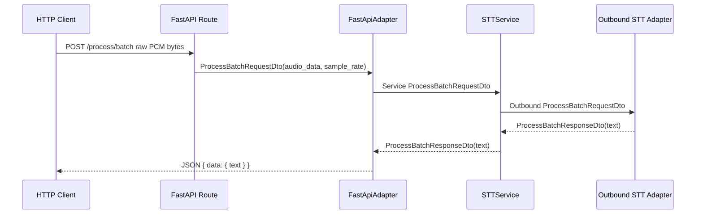
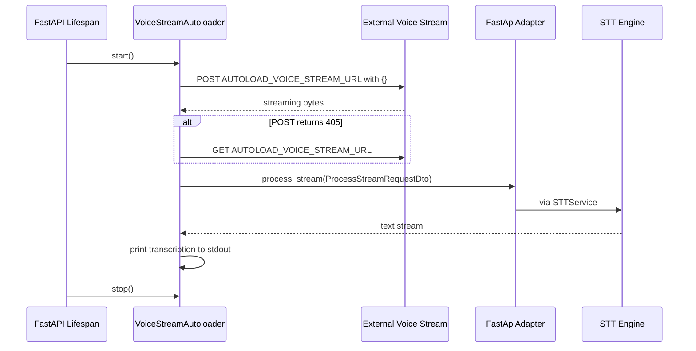

# STT Microservice Technical README

This README is a technical knowledge-transfer document generated from inspection of the current repository. It is intended for future maintainers and for developers or AI systems creating derived projects from this codebase.

Where behavior is not explicitly guaranteed by code, it is marked as **Inferred** or **Needs verification**.

## Project Overview

### What the project does

This project implements a small Speech-to-Text (STT) HTTP microservice in Python. It exposes a FastAPI server that accepts raw audio over HTTP and returns transcribed text using one of two outbound STT engines:

- OpenAI Whisper API through the `openai` Python SDK.
- Local Whisper inference through `faster-whisper`.

The selected engine is controlled by the `STT_ENGINE` environment variable.

The service supports:

- Health checking through `GET /health`.
- STT engine availability checking through `GET /available`.
- Streaming audio transcription through `POST /process/stream`, returning Server-Sent Events (SSE).
- Batch audio transcription through `POST /process/batch`, returning JSON.
- Optional background autoloading from an external audio stream URL configured by `AUTOLOAD_VOICE_STREAM_URL`.

### Main responsibilities

- Host a FastAPI application through Uvicorn.
- Convert inbound HTTP requests into internal DTOs.
- Delegate STT work through an application service and outbound adapter port.
- Segment streaming audio by volume/silence thresholds.
- Transcribe utterances using either OpenAI Whisper or a local faster-whisper model.
- Return transcription results through HTTP JSON or SSE.
- Optionally consume an external voice stream in the background and print transcriptions to stdout.

### Core business logic

The core business logic is STT orchestration, not audio capture or audio format conversion beyond raw PCM handling and simple resampling.

The service assumes audio input is raw signed 16-bit PCM bytes. This is visible in both adapters:

- `infrastructure/outbound/openai_stt_adapter.py` converts raw PCM bytes into a temporary WAV file before sending it to OpenAI.
- `infrastructure/outbound/local_stt_adapter.py` converts raw PCM bytes with `np.frombuffer(..., np.int16)` and normalizes to float audio for faster-whisper.

Streaming mode uses basic voice activity detection (VAD)-like logic:

- Track volume from int16 PCM samples.
- Accumulate audio while speech is detected.
- Treat an utterance as complete after `silence_limit_seconds` worth of silent chunks.
- Transcribe each completed utterance.
- Yield only non-empty transcription results.

The OpenAI and local adapters implement this logic independently with slightly different algorithms.

### Main workflows and lifecycle

1. `main.py` calls `asyncio.run(setup())`.
2. `composition_root/setup/setup.py` loads `.env`, reads host/port, builds the dependency graph, and starts Uvicorn.
3. `composition_root/dependencies/stt_dependency.py` selects the outbound STT adapter.
4. `STTService` is created with the outbound adapter.
5. `FastApiAdapter` is created with the service and registers routes on the FastAPI app.
6. FastAPI lifespan starts optional autoload background consumption.
7. Runtime requests flow from HTTP route -> inbound adapter -> service -> outbound STT adapter.
8. Uvicorn serves until interrupted.
9. FastAPI lifespan stops the autoloader if configured.
10. `setup()` calls `_cleanup(container)`, which currently only logs a message.

## Architecture

### High-level architecture

The code follows a ports-and-adapters style:

- `application/ports`: abstract inbound, service, and outbound contracts.
- `application/dtos`: dataclass DTOs per layer.
- `application/services`: application service implementation.
- `infrastructure/inbound/http`: FastAPI inbound adapter and optional autoload worker.
- `infrastructure/outbound`: OpenAI and local faster-whisper adapters.
- `composition_root`: dependency construction and runtime setup.



### Component relationships

```mermaid
classDiagram
    class AdapterInboundPort {
        +process_stream(request)
        +process_batch(request)
        +is_available(request)
        +get_app
        +start_autoload()
        +stop_autoload()
    }

    class ServicePort {
        +process_stream(request)
        +process_batch(request)
        +is_available(request)
    }

    class AdapterOutboundPort {
        +process_stream(request)
        +process_batch(request)
        +is_available(request)
    }

    class FastApiAdapter
    class STTService
    class OpenAISTTAdapter
    class LocalSTTAdapter
    class VoiceStreamAutoloader

    AdapterInboundPort <|-- FastApiAdapter
    ServicePort <|-- STTService
    AdapterOutboundPort <|-- OpenAISTTAdapter
    AdapterOutboundPort <|-- LocalSTTAdapter
    FastApiAdapter --> ServicePort
    STTService --> AdapterOutboundPort
    FastApiAdapter --> VoiceStreamAutoloader
```



### Internal modules and responsibilities

| Module | Responsibility |
| --- | --- |
| `main.py` | Process entry point. Runs async setup and catches `KeyboardInterrupt`. |
| `composition_root/setup/setup.py` | Loads environment variables, creates the dependency container, configures and starts Uvicorn. |
| `composition_root/containers/container.py` | Defines the immutable `Container` dataclass and builds the STT dependency graph. |
| `composition_root/dependencies/stt_dependency.py` | Selects OpenAI or local outbound adapter, creates `STTService`, creates FastAPI app, wires lifespan hooks, creates `FastApiAdapter`. |
| `application/ports/*.py` | Abstract contracts for inbound adapter, service, and outbound adapter. |
| `application/dtos/*.py` | Layer-specific dataclass DTO definitions. |
| `application/dtos/mapper/*.py` | Pass-through mapping between DTO types in each layer. |
| `application/services/service.py` | Application orchestration. Converts service DTOs to outbound DTOs and delegates STT work. |
| `infrastructure/inbound/http/fastapi_adapter.py` | Registers HTTP routes and implements inbound adapter methods. |
| `infrastructure/inbound/http/voice_stream_autoloader.py` | Background task that connects to an external audio stream and sends it through the same inbound stream processing path. |
| `infrastructure/outbound/openai_stt_adapter.py` | OpenAI Whisper outbound adapter. Converts raw PCM to temporary WAV and calls OpenAI audio transcription. |
| `infrastructure/outbound/local_stt_adapter.py` | Local faster-whisper outbound adapter. Converts raw PCM to float arrays and transcribes locally. |
| `tests/simple.py` | Manual async HTTP integration smoke test for `/health` and `/available`. |
| `.vscode/launch.json` | VS Code launch configs using `windows/Scripts/python.exe`. |
| `.vscode/settings.json` | VS Code Python interpreter settings. |
| `requirements.windows.txt` | Python dependency list. |

### Data flow between modules

Streaming request flow:



Batch request flow:



Autoload flow:



### Dependency graph

Runtime dependency construction is centralized in `generate_stt_dependency()`:

```text
BuildContainer("STT Microservice")
  -> generate_stt_dependency()
       -> read STT_ENGINE
       -> OpenAISTTAdapter(OPENAI_API_KEY, whisper-1)
          OR LocalSTTAdapter(small.en)
       -> STTService(name="stt_service", outbound_port=adapter_outbound)
       -> FastAPI(...)
       -> FastApiAdapter(service_port=service, app=app, config=AUTOLOAD_VOICE_STREAM_URL)
       -> STTDependency(adapter_outbound, service, adapter_inbound)
```

## Repository Structure

Important project-owned files and folders:

```text
.
|-- .env
|-- .vscode/
|   |-- launch.json
|   `-- settings.json
|-- application/
|   |-- dtos/
|   |   |-- adapter_inbound_dtos.py
|   |   |-- adapter_outbound_dtos.py
|   |   |-- services_dtos.py
|   |   `-- mapper/
|   |-- ports/
|   |   |-- adapter_inbound_port.py
|   |   |-- adapter_outbound_port.py
|   |   `-- service_port.py
|   `-- services/
|       `-- service.py
|-- composition_root/
|   |-- containers/
|   |   `-- container.py
|   |-- dependencies/
|   |   `-- stt_dependency.py
|   `-- setup/
|       `-- setup.py
|-- infrastructure/
|   |-- inbound/
|   |   `-- http/
|   |       |-- fastapi_adapter.py
|   |       `-- voice_stream_autoloader.py
|   `-- outbound/
|       |-- local_stt_adapter.py
|       `-- openai_stt_adapter.py
|-- tests/
|   `-- simple.py
|-- windows/
|-- main.py
`-- requirements.windows.txt
```

### Important folders

| Path | Purpose |
| --- | --- |
| `application/` | Framework-independent application contracts, DTOs, mapping, and orchestration service. |
| `composition_root/` | Runtime wiring, environment-driven adapter selection, FastAPI app construction, Uvicorn startup. |
| `infrastructure/inbound/http/` | FastAPI HTTP adapter and background HTTP stream consumer. |
| `infrastructure/outbound/` | Concrete STT implementations. |
| `tests/` | Manual integration smoke test script. |
| `windows/` | Checked-in Windows virtual environment. This is not source code. It contains Python executable, scripts, and installed site-packages. |
| `.vscode/` | Local editor/debug configuration. |

### Entry points

| Entry point | Purpose |
| --- | --- |
| `python main.py` | Starts the service. |
| `composition_root.setup.setup.setup()` | Async setup used by `main.py`. |
| `tests/simple.py` | Manual integration test against a running server at `http://127.0.0.1:8001`. |
| FastAPI generated docs | `GET /docs`, `GET /redoc`, and `GET /openapi.json` are enabled. |

## Runtime Flow

### Startup sequence

1. `main.py` imports `setup` from `composition_root.setup.setup`.
2. `asyncio.run(setup())` starts the async runtime.
3. `setup()` searches for `.env` using `find_dotenv('.env')`.
4. If found, `.env` is loaded using `load_dotenv`.
5. `SERVICE_HOST` is read with default `127.0.0.1`.
6. `SERVICE_PORT` is read with default `8001` and cast to `int`.
7. `BuildContainer(name="STT Microservice")` is called.
8. `generate_stt_dependency()` reads `STT_ENGINE`.
9. If `STT_ENGINE == "openai"`:
   - `OPENAI_API_KEY` is required.
   - `OpenAISTTAdapter` is created with model name `whisper-1`.
10. Otherwise:
   - `LocalSTTAdapter` is created with model name `small.en`.
11. `STTService` is created with the outbound adapter.
12. FastAPI app is created with title, description, version, docs URLs, and lifespan hook.
13. `FastApiAdapter` is created and registers routes.
14. Uvicorn `Config` is created with:
   - `host=SERVICE_HOST`
   - `port=SERVICE_PORT`
   - `log_level="info"`
   - `timeout_keep_alive=60`
15. Uvicorn server starts and blocks until shutdown.

### Initialization process

Dependency initialization is synchronous except for FastAPI lifespan:

- Adapter selection happens before the server starts.
- Local model loading happens during `LocalSTTAdapter.__init__`.
- OpenAI client creation for streaming happens when a stream is processed, not at startup.
- OpenAI client creation for batch happens per batch request.
- Autoloader task starts only during FastAPI lifespan startup.

**Needs verification:** The local faster-whisper model may be downloaded or loaded from local Hugging Face cache depending on environment. The repository does not pin local model storage paths.

### Service registration

HTTP routes are registered inside `FastApiAdapter.register_routes()`:

- `GET /health`
- `GET /available`
- `POST /process/stream`
- `POST /process/batch`

FastAPI's built-in docs are registered by FastAPI app configuration:

- `GET /docs`
- `GET /redoc`
- `GET /openapi.json`

### Request lifecycle

For every STT request:

1. FastAPI route receives HTTP input.
2. Route constructs an inbound DTO.
3. Inbound adapter maps DTO to service DTO.
4. `STTService` maps DTO to outbound DTO.
5. Outbound adapter performs STT.
6. Response DTOs are mapped back up the stack.
7. HTTP response is emitted as JSON or SSE.

The mapping functions currently copy fields directly. They are useful extension points if layer-specific fields diverge in the future.

### Shutdown behavior

Shutdown behavior includes:

- `KeyboardInterrupt` is caught in `main.py` only around `asyncio.run(setup())`.
- Uvicorn manages normal ASGI shutdown.
- FastAPI lifespan calls `adapter_inbound.stop_autoload()` if an autoloader exists.
- `VoiceStreamAutoloader.stop()` cancels the background task and suppresses `asyncio.CancelledError`.
- `setup()` finally calls `_cleanup(container)`, which currently logs `"Performing graceful shutdown cleanup..."` and has no real cleanup actions.

**Needs verification:** There is no explicit cleanup of local Whisper model resources, OpenAI clients, or pending transcription queues beyond task cancellation.

## Ports & Interfaces

### Quick Port Reference

Default inbound service:

- Host: `127.0.0.1`
- Port: `8001`
- Protocol: HTTP
- Framework: FastAPI served by Uvicorn
- Main endpoints:
  - `GET /health`
  - `GET /available`
  - `POST /process/batch`
  - `POST /process/stream`
  - `GET /docs`
  - `GET /redoc`
  - `GET /openapi.json`

Optional outbound autoload source:

- URL: `AUTOLOAD_VOICE_STREAM_URL`
- Example from `.env`: `http://127.0.0.1:8000/start`
- Protocol: HTTP streaming response
- Method: starts with `POST` and JSON body `{}`; falls back to `GET` if response status is `405`.

External STT:

- OpenAI Audio Transcriptions API when `STT_ENGINE=openai`.
- Local CPU faster-whisper model when `STT_ENGINE` is anything other than `openai`.

### Inbound interface table

| Type | Port | Protocol | Path/Topic | Purpose | Handler | Dependencies |
| --- | --- | --- | --- | --- | --- | --- |
| HTTP | `SERVICE_PORT`, default `8001` | HTTP | `GET /health` | Service liveness check | `FastApiAdapter.register_routes.health_check` | None |
| HTTP | `SERVICE_PORT`, default `8001` | HTTP | `GET /available` | STT engine availability check | `FastApiAdapter.register_routes.handle_check_availability` | `STTService.is_available`, outbound adapter |
| HTTP/SSE | `SERVICE_PORT`, default `8001` | HTTP, SSE response | `POST /process/stream` | Stream raw PCM audio and receive incremental transcriptions | `FastApiAdapter.register_routes.handle_process_stream` | `STTService.process_stream`, selected STT adapter |
| HTTP | `SERVICE_PORT`, default `8001` | HTTP | `POST /process/batch` | Submit complete raw PCM audio buffer and receive full transcription | `FastApiAdapter.register_routes.handle_process_batch` | `STTService.process_batch`, selected STT adapter |
| HTTP | `SERVICE_PORT`, default `8001` | HTTP | `GET /docs` | Swagger UI | FastAPI built-in | OpenAPI schema |
| HTTP | `SERVICE_PORT`, default `8001` | HTTP | `GET /redoc` | ReDoc UI | FastAPI built-in | OpenAPI schema |
| HTTP | `SERVICE_PORT`, default `8001` | HTTP | `GET /openapi.json` | OpenAPI schema | FastAPI built-in | Registered routes |
| Background worker | N/A | HTTP client stream | `AUTOLOAD_VOICE_STREAM_URL` | Pull external audio stream and print transcriptions | `VoiceStreamAutoloader._worker` | `httpx`, inbound adapter, selected STT adapter |

No GraphQL operations, WebSocket endpoints, MQTT topics, serial ports, gRPC services, message queues, webhooks, file watchers, IPC mechanisms, or internal event buses were found in the project-owned source.

### `GET /health`

| Field | Value |
| --- | --- |
| Port | `SERVICE_PORT`, default `8001` |
| Protocol | HTTP |
| Path | `/health` |
| Purpose | Liveness check for the HTTP service. |
| Authentication | None implemented. |
| Request format | No body. |
| Response format | JSON envelope. |
| Handler | `FastApiAdapter.register_routes.health_check` in `infrastructure/inbound/http/fastapi_adapter.py`. |
| Dependencies triggered | None. |
| Side effects | None. |
| Required environment variables | `SERVICE_HOST`, `SERVICE_PORT` only for server binding. |
| Failure behavior | No explicit failure path in handler. Unexpected framework errors would be handled by FastAPI/Uvicorn. |
| Timeouts/retry behavior | No endpoint-specific timeout or retry. Uvicorn keep-alive timeout is 60 seconds. |

Example request:

```bash
curl http://127.0.0.1:8001/health
```

Example response:

```json
{
  "action": "health_check",
  "status": "success",
  "status_code": 200,
  "message": "Service is healthy",
  "timestamp": 1710000000.0,
  "data": null
}
```

### `GET /available`

| Field | Value |
| --- | --- |
| Port | `SERVICE_PORT`, default `8001` |
| Protocol | HTTP |
| Path | `/available` |
| Purpose | Reports whether the configured STT engine appears available. |
| Authentication | None implemented. |
| Request format | No body. |
| Response format | JSON envelope with boolean `data`. |
| Handler | `FastApiAdapter.register_routes.handle_check_availability`. |
| Dependencies triggered | `FastApiAdapter.is_available` -> `STTService.is_available` -> outbound adapter `is_available`. |
| Side effects | None expected. |
| Required environment variables | For OpenAI engine: `STT_ENGINE=openai`, `OPENAI_API_KEY`. For local engine: `STT_ENGINE` not equal to `openai`. |
| Failure behavior | Any exception returns HTTP 500 with error string in `message` and `data`. |
| Timeouts/retry behavior | No endpoint-specific timeout or retry. |

OpenAI availability behavior:

- Returns `true` if `self.api_key` is truthy.
- Does not make a network call.
- Does not verify key validity.

Local availability behavior:

- Returns `true` if `self.model is not None`.

Example request:

```bash
curl http://127.0.0.1:8001/available
```

Example response:

```json
{
  "action": "check_availability",
  "status": "success",
  "status_code": 200,
  "message": "Availability checked successfully",
  "timestamp": 1710000000.0,
  "data": true
}
```

### `POST /process/batch`

| Field | Value |
| --- | --- |
| Port | `SERVICE_PORT`, default `8001` |
| Protocol | HTTP |
| Path | `/process/batch` |
| Purpose | Transcribe a complete raw audio buffer. |
| Authentication | None implemented. |
| Request format | Raw request body containing signed 16-bit PCM audio bytes. Optional query parameter: `sample_rate`, default `16000`. |
| Response format | JSON envelope with `data.text`. |
| Handler | `FastApiAdapter.register_routes.handle_process_batch`. |
| Dependencies triggered | `STTService.process_batch`, selected outbound adapter, OpenAI API or local faster-whisper model. |
| Side effects | OpenAI engine creates and deletes a temporary `.wav` file. Local engine performs CPU inference. Logs may be written to stdout. |
| Required environment variables | `STT_ENGINE`; `OPENAI_API_KEY` if OpenAI; `SERVICE_HOST`; `SERVICE_PORT`. |
| Failure behavior | Empty body raises `HTTPException(400)`, but the broad `except Exception` catches it and returns HTTP 500. Other exceptions also return HTTP 500 with error string. |
| Timeouts/retry behavior | No explicit retry. No endpoint-specific timeout. Client-side and Uvicorn behavior apply. |

Expected audio format:

- Raw PCM bytes.
- Signed 16-bit integer samples.
- Mono is assumed by OpenAI WAV writer (`_WAV_CHANNELS = 1`).
- `sample_rate` defaults to `16000`.
- Local adapter resamples to 16000 Hz using `np.interp` if a different sample rate is passed.
- OpenAI adapter writes a WAV file using the passed sample rate.

Example request using raw PCM file:

```bash
curl -X POST "http://127.0.0.1:8001/process/batch?sample_rate=16000" \
  --header "Content-Type: application/octet-stream" \
  --data-binary "@audio.raw"
```

Example success response:

```json
{
  "action": "process_batch",
  "status": "success",
  "status_code": 200,
  "message": "Audio processed successfully",
  "timestamp": 1710000000.0,
  "data": {
    "text": "transcribed speech"
  }
}
```

Example failure response:

```json
{
  "action": "process_batch",
  "status": "error",
  "status_code": 500,
  "message": "Failed to process batch: ...",
  "timestamp": 1710000000.0,
  "data": "..."
}
```

### `POST /process/stream`

| Field | Value |
| --- | --- |
| Port | `SERVICE_PORT`, default `8001` |
| Protocol | HTTP request body stream, SSE response (`text/event-stream`) |
| Path | `/process/stream` |
| Purpose | Process a streamed raw PCM audio request and yield transcription events. |
| Authentication | None implemented. |
| Request format | Streaming request body of signed 16-bit PCM bytes. Query parameters: `sample_rate`, `chunk_size`, `silence_threshold`, `silence_limit_seconds`. |
| Response format | Server-Sent Events. Each yielded transcription is formatted as `data: <text>\n\n`. |
| Handler | `FastApiAdapter.register_routes.handle_process_stream`. |
| Dependencies triggered | `STTService.process_stream`, selected outbound adapter, OpenAI API or local faster-whisper model. |
| Side effects | Transcription logs and volume debug output printed to stdout. OpenAI engine creates temporary WAV files per utterance. Local engine creates an internal VAD task and transcription queue. |
| Required environment variables | `STT_ENGINE`; `OPENAI_API_KEY` if OpenAI; `SERVICE_HOST`; `SERVICE_PORT`. |
| Failure behavior | Exceptions before `StreamingResponse` creation return HTTP 500 JSON. Exceptions during streaming may terminate the stream; behavior is framework/client dependent. |
| Timeouts/retry behavior | No explicit retry. Uvicorn keep-alive timeout is 60 seconds. OpenAI SDK default timeout behavior applies unless overridden by SDK defaults. |

Query parameters:

| Parameter | Type | Default | Purpose |
| --- | --- | --- | --- |
| `sample_rate` | `int` | `16000` | Source audio sample rate in Hz. |
| `chunk_size` | `int` | `1024` | Used to calculate chunks per second for silence duration. It does not force HTTP chunk sizes. |
| `silence_threshold` | `int` | `150` | Volume threshold for silence/speech detection. |
| `silence_limit_seconds` | `float` | `2.0` | Required silence duration before an utterance is considered complete. |

Example request:

```bash
curl -N -X POST "http://127.0.0.1:8001/process/stream?sample_rate=16000&chunk_size=1024&silence_threshold=150&silence_limit_seconds=2.0" \
  --header "Content-Type: application/octet-stream" \
  --data-binary "@audio.raw"
```

Example SSE response:

```text
data: hello world

data: this is another utterance

```

Response headers set by the route:

```text
Cache-Control: no-cache
Connection: keep-alive
X-Action: process_stream
X-Status: success
X-Message: Stream processed successfully
X-Timestamp: <unix timestamp>
Content-Type: text/event-stream; charset=utf-8
```

### FastAPI documentation endpoints

FastAPI is configured with:

| Path | Purpose |
| --- | --- |
| `/docs` | Swagger UI |
| `/redoc` | ReDoc UI |
| `/openapi.json` | OpenAPI schema |

Authentication is not configured for these endpoints.

### Background autoload interface

This is not an inbound port exposed by the service. It is an outbound HTTP client worker triggered by service startup when `AUTOLOAD_VOICE_STREAM_URL` is set.

| Field | Value |
| --- | --- |
| Type | Background worker / HTTP client |
| Config | `AUTOLOAD_VOICE_STREAM_URL` |
| Example URL | `http://127.0.0.1:8000/start` from current `.env` |
| Initial method | `POST` |
| Initial body | JSON `{}` |
| Fallback | If status is `405` and method was `POST`, switch to `GET` and retry immediately. |
| Response expected | Streaming response body containing raw signed 16-bit PCM bytes. |
| Handler | `VoiceStreamAutoloader._worker` |
| Internal processing | Wraps response bytes in `ProcessStreamRequestDto` with defaults and calls `inbound_adapter.process_stream`. |
| Output | Prints `[Autoload Transcription] <text>` to stdout. No HTTP response is emitted by this service. |
| Retry behavior | On `httpx.RequestError`, waits 5 seconds then reconnects. On other exceptions, prints traceback, waits 5 seconds, and retries. |
| Timeout | `httpx.AsyncClient(timeout=None)`, meaning the stream can remain open indefinitely. |
| Shutdown | `stop()` cancels the task. |

Default autoload stream processing settings:

```python
sample_rate = 16000
chunk_size = 1024
silence_threshold = 150
silence_limit_seconds = 2.0
```

## Outbound Integrations

### OpenAI Audio Transcriptions API

| Field | Value |
| --- | --- |
| Purpose | Remote STT transcription through OpenAI Whisper. |
| Enabled when | `STT_ENGINE=openai` or `STT_ENGINE` unset, because default is `openai`. |
| Adapter | `OpenAISTTAdapter` in `infrastructure/outbound/openai_stt_adapter.py`. |
| SDK | `openai>=1.14.0`. |
| Model | Hard-coded `_WHISPER_MODEL = "whisper-1"`. |
| Authentication | `OPENAI_API_KEY`. |
| Request format | Temporary WAV file created from raw PCM bytes. |
| Response format | `response_format="text"`; adapter returns stripped string when result is `str`. |
| Retry behavior | No explicit retry in project code. OpenAI SDK internal defaults may apply. |
| Failure modes | Missing API key prevents startup. Invalid key, network errors, API errors, audio format issues, and rate limits propagate as exceptions and become HTTP 500 in route handlers. |
| Required configs | `STT_ENGINE=openai`, `OPENAI_API_KEY`. |

Important implementation details:

- Streaming mode buffers utterances, writes each utterance to a temp `.wav`, sends it to OpenAI, and deletes the temp file in `finally`.
- Batch mode writes the full request body to a temp `.wav`, sends it to OpenAI, and deletes the temp file in `finally`.
- The configured DTO model name is printed but not used to select the OpenAI model. `_WHISPER_MODEL` is hard-coded to `whisper-1`.

### Local faster-whisper

| Field | Value |
| --- | --- |
| Purpose | CPU-local STT without OpenAI API calls. |
| Enabled when | `STT_ENGINE` is any value other than exactly `openai` after lowercasing. |
| Adapter | `LocalSTTAdapter` in `infrastructure/outbound/local_stt_adapter.py`. |
| Library | `faster-whisper>=1.0.1`. |
| Model | `small.en` hard-coded in composition root unless config is changed. |
| Authentication | None. |
| Device | `cpu`. |
| Compute type | `int8`. |
| CPU threads | `2`. |
| Retry behavior | None. |
| Failure modes | Model load failure, missing model cache/download failure, unsupported platform, insufficient CPU/RAM, invalid audio buffer, inference exceptions. |
| Required configs | `STT_ENGINE` set to non-`openai` value, for example `local`. |

Transcription parameters:

```python
beam_size=5
language="en"
condition_on_previous_text=False
no_speech_threshold=0.65
```

**Inferred:** faster-whisper may need network access at first run to download `small.en` if not already cached. This repository does not document or configure a model cache path.

### External autoload voice stream

| Field | Value |
| --- | --- |
| Purpose | Continuously consume a remote/local audio stream and transcribe it without client calls to this service. |
| Enabled when | `AUTOLOAD_VOICE_STREAM_URL` is non-empty. |
| Client | `httpx.AsyncClient(timeout=None)`. |
| Authentication | None implemented. |
| Request format | `POST` with `{}` first, fallback to `GET` on 405. |
| Expected response | Stream of raw signed 16-bit PCM bytes. |
| Retry behavior | Reconnect every 5 seconds on `httpx.RequestError` or unexpected exception. |
| Failure modes | Source unavailable, unsupported method, non-2xx response, stream format mismatch, endless reconnect loop. |
| Required configs | `AUTOLOAD_VOICE_STREAM_URL`. |

### Databases, message brokers, and hardware devices

No database clients, message queues, MQTT clients, serial libraries, hardware device interfaces, Redis clients, SQLAlchemy, or file watchers were found in project-owned source.

## Data Model

This project has no persistent domain database model. Its internal data model is a set of dataclass DTOs.

### Key entities

| Entity | Location | Fields | Purpose |
| --- | --- | --- | --- |
| `InitInboundAdapterDto` | `application/dtos/adapter_inbound_dtos.py` | `autoload_voice_stream_url: Optional[str] = None` | Configures optional inbound autoload worker. |
| `InitOutboundAdapterDto` | `application/dtos/adapter_outbound_dtos.py` | `api_key: str = ""`, `model_name: str = "whisper-1"` | Configures outbound STT adapter. |
| `ProcessStreamRequestDto` | In inbound, service, outbound DTO modules | `audio_stream`, `sample_rate`, `chunk_size`, `silence_threshold`, `silence_limit_seconds` | Carries streaming audio and VAD settings. |
| `ProcessStreamResponseDto` | In inbound, service, outbound DTO modules | `text_stream` | Carries async stream of transcription strings. |
| `ProcessBatchRequestDto` | In inbound, service, outbound DTO modules | `audio_data`, `sample_rate` | Carries full audio buffer. |
| `ProcessBatchResponseDto` | In inbound, service, outbound DTO modules | `text` | Carries final transcription text. |
| `STTAvailabilityRequestDto` | In inbound, service, outbound DTO modules | No fields | Availability request marker. |
| `STTAvailabilityResponseDto` | In inbound, service, outbound DTO modules | `is_available: bool` | Availability result. |
| `Container` | `composition_root/containers/container.py` | `name`, `stt_dependency` | Immutable application container. |
| `STTDependency` | `composition_root/dependencies/stt_dependency.py` | `adapter_outbound`, `service`, `adapter_inbound` | Wired STT dependency graph. |

### Data schemas

The DTOs are `@dataclass(slots=True, frozen=True)`, making request/response DTO objects immutable and slot-backed.

The three layers currently duplicate similar DTO classes:

- Inbound DTOs.
- Service DTOs.
- Outbound DTOs.

Mappers translate between them by field copying.

### Database structure

There is no database schema.

### Important models

The only ML/STT models are:

- OpenAI `whisper-1`, hard-coded in `OpenAISTTAdapter`.
- faster-whisper `small.en`, selected in `generate_stt_dependency()` for local mode.

### Relationships

```text
FastApiAdapter
  owns optional VoiceStreamAutoloader
  depends on ServicePort

STTService
  depends on AdapterOutboundPort

OpenAISTTAdapter or LocalSTTAdapter
  implements AdapterOutboundPort
```

### Caching strategy

No application-level cache exists.

**Inferred:** faster-whisper/CTranslate2/Hugging Face may use external model caching mechanisms, but the application does not configure or manage them.

## Configuration

### Environment variables

| Variable | Required | Default | Purpose | Example |
| --- | --- | --- | --- | --- |
| `APP_ENV` | No | None in code | Used only by `.env` and VS Code launch config. The application does not read it directly. | `debug` |
| `SERVICE_HOST` | No | `127.0.0.1` | Host/IP passed to Uvicorn. | `127.0.0.1` |
| `SERVICE_PORT` | No | `8001` | TCP port passed to Uvicorn. Must parse as integer. | `8001` |
| `STT_ENGINE` | No | `openai` | Selects outbound adapter. Exactly `openai` uses OpenAI. Any other value uses local faster-whisper. | `openai` or `local` |
| `OPENAI_API_KEY` | Required if `STT_ENGINE=openai` | None | API key for OpenAI SDK. Startup fails if missing in OpenAI mode. | `sk-...` |
| `AUTOLOAD_VOICE_STREAM_URL` | No | None | Optional external HTTP stream URL consumed at startup. | `http://127.0.0.1:8000/start` |

### Config files

| File | Purpose |
| --- | --- |
| `.env` | Local environment loaded by `find_dotenv('.env')` and `load_dotenv`. Contains service host/port, engine choice, OpenAI key, autoload URL. |
| `.vscode/launch.json` | VS Code debug/run configs. Debug uses `.env`; production config references `.env.production`. |
| `.vscode/settings.json` | Points VS Code to `windows/Scripts/python.exe`. |
| `requirements.windows.txt` | pip requirements for Windows environment. |

### Secrets required

- `OPENAI_API_KEY` is required for OpenAI mode.

Security note: the current `.env` contains an OpenAI API key value. Treat it as compromised, rotate it, and do not commit replacement secrets to source control.

### Mandatory vs optional settings

OpenAI mode requires:

```env
STT_ENGINE=openai
OPENAI_API_KEY=<secret>
```

Local mode requires:

```env
STT_ENGINE=local
```

Optional service binding:

```env
SERVICE_HOST=127.0.0.1
SERVICE_PORT=8001
```

Optional autoload:

```env
AUTOLOAD_VOICE_STREAM_URL=http://127.0.0.1:8000/start
```

## Build & Deployment

### How to run locally

Using the checked-in Windows virtual environment:

```powershell
.\windows\Scripts\python.exe main.py
```

Using an external Python environment:

```powershell
python -m venv .venv
.\.venv\Scripts\Activate.ps1
pip install -r requirements.windows.txt
python main.py
```

Expected startup output includes:

```text
============================================================
 STT Microservice - Starting Server
============================================================
Host: 127.0.0.1
Port: 8001
Application started. Waiting for shutdown signal (Ctrl+C)...
```

### How to test

Start the server first, then run:

```powershell
.\windows\Scripts\python.exe tests\simple.py
```

The test script currently checks:

- `GET /health`
- `GET /available`

It does not test `/process/batch` or `/process/stream`.

### How to build

There is no project build step, package metadata, wheel configuration, or compile step in the repository.

### Docker usage

No Dockerfile or docker-compose file was found.

**Needs verification:** Production containerization requirements are not defined. Any derived deployment should explicitly add Docker and model cache handling if local STT is used.

### CI/CD behavior

No CI/CD configuration files were found in project-owned source. There is no `.github/workflows`, GitLab CI, Azure Pipelines, or similar pipeline configuration.

### Production deployment process

No production deployment process is codified.

The VS Code launch config includes a "Python: Run (production env)" entry that references `.env.production`, but `.env.production` was not found in the repository.

**Needs verification:** Whether production is intended to run through VS Code, raw Python, a process manager, Windows service, or container is not documented in code.

### Infrastructure assumptions

Observed assumptions:

- Python is available, and the checked-in environment uses Python 3.14 based on `__pycache__` tags and `windows/pyvenv.cfg` presence.
- Default service binds to localhost, not all interfaces.
- OpenAI mode needs internet access to OpenAI APIs.
- Local mode needs enough CPU/RAM for `small.en` faster-whisper inference.
- Autoload mode assumes another HTTP service may be running at `127.0.0.1:8000/start`.

## Dependencies

Dependencies from `requirements.windows.txt`:

| Dependency | Version constraint | Why it is used |
| --- | --- | --- |
| `fastapi` | `>=0.110.0` | HTTP API framework, docs, routing, ASGI app. |
| `uvicorn` | `>=0.29.0` | ASGI server used to run FastAPI. |
| `python-dotenv` | `>=1.0.1` | Loads `.env` into process environment. |
| `pydantic` | `>=2.6.4` | FastAPI dependency. Not directly used for project DTOs. |
| `numpy` | `>=1.26.4` | PCM audio conversion, volume calculation, normalization, simple resampling. |
| `openai` | `>=1.14.0` | OpenAI Whisper transcription client. |
| `faster-whisper` | `>=1.0.1` | Local Whisper transcription implementation. |
| `httpx` | `>=0.27.0` | Autoload external streaming HTTP client and test client. |

Critical version notes:

- The repository has broad lower-bound-only dependency constraints. There are no upper bounds or lock files.
- The checked-in `windows/` environment contains installed package artifacts, but `requirements.windows.txt` is the only explicit dependency manifest.
- **Needs verification:** Compatibility with Python 3.14 should be validated for all ML/audio packages, especially `faster-whisper`, `ctranslate2`, `onnxruntime`, and `av`.

## State & Persistence

### Databases

No database is used.

### File storage

OpenAI adapter creates temporary `.wav` files through `tempfile.NamedTemporaryFile(delete=False)` and deletes them in `finally`.

Temporary file behavior:

- Streaming OpenAI: one temp WAV per completed utterance.
- Batch OpenAI: one temp WAV per request.
- Cleanup uses `os.remove(path)` and suppresses `OSError`.

### Cache

No application cache.

**Inferred:** local faster-whisper model files may be cached by external library mechanisms outside this repo.

### Session management

No user sessions.

### Persistent runtime state

In-memory runtime state includes:

- Local adapter holds a loaded `WhisperModel` instance.
- OpenAI streaming iterator holds an `OpenAI` client, audio buffer, silence counters, smoothed volume, noise floor, and speaking state.
- Local streaming iterator holds an audio buffer, silence counter, queue, and background VAD task.
- Autoloader holds one asyncio task.

None of this state persists across process restarts.

## Failure & Recovery

### Known failure points

| Area | Failure point | Current behavior |
| --- | --- | --- |
| Startup | Missing `OPENAI_API_KEY` in OpenAI mode | Raises `RuntimeError`; service does not start. |
| Startup | `SERVICE_PORT` is not an integer | `int(...)` raises; service does not start. |
| Startup | Local model cannot load | Exception propagates; service does not start. |
| `/process/batch` | Empty request body | Intended `HTTPException(400)`, but broad catch returns HTTP 500. |
| `/process/batch` | Invalid/non-PCM audio | Likely adapter exception or poor transcription; returns HTTP 500 if exception occurs. |
| `/process/stream` | Stream ends before silence completes | Iterator may stop without yielding buffered final audio depending on adapter behavior. Needs verification for final partial utterance handling. |
| OpenAI | Invalid API key/rate limit/network error | Exception becomes HTTP 500 from route handlers. |
| OpenAI | Temp file cleanup failure | Suppressed. |
| Local | Model inference error | Exception becomes HTTP 500 or stream termination. |
| Autoload | Source connection error | Logs and retries after 5 seconds. |
| Autoload | Source returns 405 to POST | Switches to GET and retries. |
| Autoload | Source returns other non-2xx | `raise_for_status()` triggers exception, logs traceback, retries after 5 seconds. |

### Retry logic

Implemented retry logic exists only in `VoiceStreamAutoloader`:

- `httpx.RequestError`: wait 5 seconds and retry.
- Unexpected exception: print traceback, wait 5 seconds and retry.
- `405 Method Not Allowed` on initial POST: switch to GET and continue immediately.

No explicit retry logic exists for:

- OpenAI transcription calls.
- Local model transcription.
- HTTP inbound requests.

### Error handling strategy

HTTP route handlers use broad `except Exception` blocks and return a JSON error envelope with HTTP 500.

Consequences:

- Client errors can be misreported as server errors.
- Full exception strings are returned in response bodies, which can leak operational details.
- No structured logging framework is used.

### Recovery mechanisms

- Manual restart recovers startup/runtime failures.
- Autoload reconnect loop recovers from temporary external stream failures.
- OpenAI temp files are deleted in `finally` blocks.
- FastAPI lifespan cancels autoload task on shutdown.

## Security

### Authentication

No inbound authentication is implemented.

All HTTP endpoints are publicly callable by any client that can reach the bound host/port.

### Authorization

No authorization model is implemented.

### Secrets handling

- OpenAI credentials are loaded from environment variable `OPENAI_API_KEY`.
- The current `.env` file contains a real-looking API key value. Rotate it and remove secrets from committed files.
- There is no secret manager integration.

### Sensitive flows

Sensitive flows include:

- Raw audio sent to `/process/batch` or `/process/stream`.
- Raw audio sent to OpenAI in OpenAI mode.
- Autoloaded audio stream from `AUTOLOAD_VOICE_STREAM_URL`.
- Transcription text printed to stdout in adapters and autoload mode.

### Exposed attack surface

Inbound attack surface:

- `GET /health`
- `GET /available`
- `POST /process/batch`
- `POST /process/stream`
- `/docs`
- `/redoc`
- `/openapi.json`

Risks:

- No authentication or rate limiting.
- Batch endpoint reads entire body into memory with `await request.body()`.
- Streaming endpoint can keep connections open.
- Local mode can consume CPU heavily.
- OpenAI mode can incur external API cost.
- Error responses expose exception strings.
- API docs are exposed.

Recommended hardening for production:

- Add authentication for STT endpoints.
- Add request body size limits.
- Add rate limiting/concurrency limits.
- Disable docs in production or protect them.
- Avoid returning raw exception messages to clients.
- Move secrets out of `.env` committed files.
- Add structured logs with redaction.
- Add timeout controls around outbound transcription calls.

## Derived Project Transfer Notes

### Reusable parts

Reusable with minimal changes:

- Ports-and-adapters structure.
- DTO mapping pattern.
- `STTService` orchestration shell.
- FastAPI route registration pattern.
- Batch transcription flow.
- Streaming SSE response shape.
- OpenAI temp WAV conversion utility.
- Local faster-whisper raw PCM conversion and resampling logic.
- Autoload worker concept for pulling a remote stream into the same processing path.

### Tightly coupled parts

Tightly coupled or implicit:

- Audio format is implicitly raw signed 16-bit PCM mono.
- OpenAI adapter hard-codes `whisper-1` despite having `model_name` in config.
- Local adapter hard-codes English transcription (`language="en"`).
- Local adapter hard-codes CPU, int8, and 2 CPU threads.
- Composition root chooses local mode for any `STT_ENGINE` value other than `openai`.
- Autoload assumes external stream bytes match the same raw PCM expectations.
- Debug volume output is printed directly to stdout from adapters.
- Route handlers know HTTP response envelope shapes directly.

### Assumptions that exist

- Requests do not require authentication.
- `sample_rate` accurately describes incoming PCM.
- `chunk_size` passed by client corresponds roughly to actual audio chunk size for silence calculations.
- Raw request body in batch mode can fit in memory.
- English-only transcription is acceptable for local mode.
- OpenAI Whisper is acceptable for OpenAI mode.
- Server runs as one process without distributed state.

### What must be preserved for compatibility

To maintain compatibility with current clients:

- Keep default port `8001` unless clients are updated.
- Keep `/health` JSON envelope shape.
- Keep `/available` JSON envelope shape and boolean `data`.
- Keep `/process/batch` accepting raw body bytes and `sample_rate` query parameter.
- Keep `/process/batch` response shape: `data.text`.
- Keep `/process/stream` accepting raw body stream and returning `text/event-stream`.
- Keep SSE event format: `data: <text>\n\n`.
- Keep query parameter names for stream thresholds.
- Preserve `STT_ENGINE`, `OPENAI_API_KEY`, `SERVICE_HOST`, `SERVICE_PORT`, and `AUTOLOAD_VOICE_STREAM_URL`.

### Recommended extension points

Best extension points:

- Add new STT engines by implementing `AdapterOutboundPort`.
- Add new inbound protocols by implementing `AdapterInboundPort`.
- Add validation/transformation in mapper modules if DTOs diverge.
- Extend `InitOutboundAdapterDto` and use it in `generate_stt_dependency()`.
- Add configuration parsing module instead of reading `os.getenv` directly in composition root.
- Add middleware for auth, request IDs, CORS, and logging.
- Add tests around service and adapter contracts.

### Safe refactoring boundaries

Relatively safe:

- Consolidate duplicate DTO definitions if layer isolation is not needed.
- Replace direct `print` calls with structured logging.
- Move response envelope construction into helpers.
- Replace broad exception handling with typed exception handlers.
- Make model name, language, device, compute type, and CPU threads configurable.
- Add body-size validation to batch endpoint.

Higher risk:

- Changing stream VAD behavior, because clients may depend on event timing.
- Changing audio input format expectations.
- Changing response envelope shapes.
- Changing autoload POST-to-GET fallback behavior.
- Changing default engine selection.

### Hidden coupling or implicit behavior

- `FastApiAdapter` creates `VoiceStreamAutoloader(config.autoload_voice_stream_url, self)`, so the autoloader calls inbound adapter methods directly and bypasses HTTP routes.
- `adapter_inbound` is assigned after the FastAPI lifespan closure is declared. The closure captures the variable and works because startup occurs later after assignment.
- `chunk_size` affects silence duration calculations but does not control the size of chunks received from `request.stream()`.
- In OpenAI streaming mode, speech start uses adaptive noise floor thresholds; in local streaming mode, it uses a simpler threshold check. Derived projects should not assume identical segmentation between engines.
- `HTTPException(400)` in batch route is swallowed by broad `except Exception` and returned as 500.
- OpenAI `InitOutboundAdapterDto.model_name` is not actually used for API calls.

### If rebuilding this project from scratch, what matters most

1. Preserve the external HTTP contract if clients already exist.
2. Decide and document the audio wire format explicitly.
3. Keep STT engine selection isolated behind an outbound port.
4. Keep streaming and batch flows separate because their resource and response behaviors differ.
5. Add explicit configuration management before expanding deployment targets.
6. Add tests for `/process/batch`, `/process/stream`, OpenAI failure handling, and local model behavior.
7. Add production controls: auth, rate limits, body limits, timeouts, logging, and secret management.
8. Treat autoload as an integration with another service, not as a hidden side effect, if rebuilding for production.

## Unknowns / Technical Debt

### Ambiguous behavior

- Final partial utterance handling in streaming mode needs verification. If the stream ends before silence threshold is reached, buffered audio may not be transcribed.
- Exact audio format expected by clients is not documented in code comments or tests beyond int16 PCM implementation.
- Local model download/cache behavior is not controlled by the app.
- Production environment is unclear. `.env.production` is referenced by VS Code but not present.
- Compatibility with Python 3.14 and all ML dependencies needs verification.

### Missing documentation

- No original README was present.
- No API examples were present for batch or streaming STT.
- No Docker/deployment documentation.
- No CI/CD documentation.
- No secret management guidance.
- No model storage/cache guidance.
- No performance/concurrency limits.

### Risk areas

- Checked-in `.env` contains an API key value.
- Checked-in `windows/` virtual environment is large and platform-specific.
- No authentication on audio-processing endpoints.
- Batch endpoint reads complete request body into memory.
- Broad exception handlers return HTTP 500 for all errors.
- Error responses include exception strings.
- No tests for actual transcription endpoints.
- No lock file or pinned exact dependency versions.
- Local mode can trigger heavy CPU work on request.
- OpenAI mode can trigger external API cost on request.

### Assumptions found in code

- Default engine is OpenAI.
- Default service bind is `127.0.0.1:8001`.
- Default audio sample rate is 16000 Hz.
- Default stream chunk size for calculations is 1024 bytes.
- Default silence threshold is 150.
- Default silence limit is 2.0 seconds.
- Local STT language is English.
- Local STT runs on CPU with int8 compute.
- Autoload stream source accepts POST with `{}` or GET after 405.

